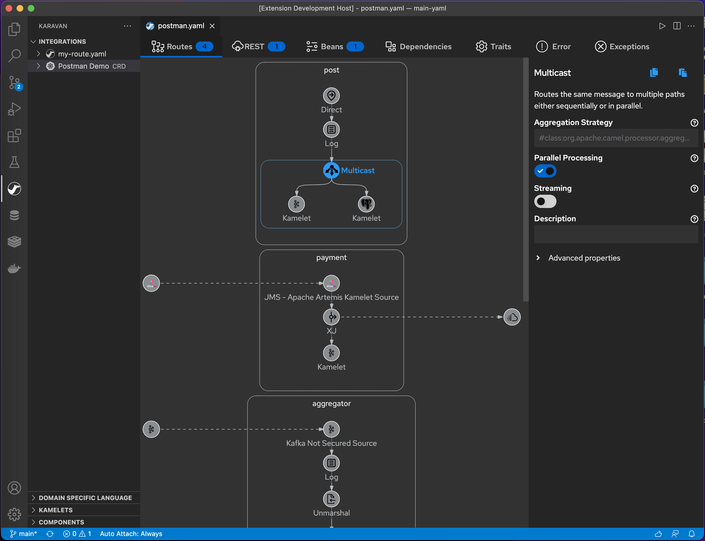

# Integration Designer for Apache Camel


**Integration Designer for Apache Camel** makes integration easy and fun through visualization of integration pipeline.



# Features

* Read/Write Integration resources (*.yaml with kind:Integration) and plain yaml routes
* Kamelets source/sink/action
* Enterprise Integration Patterns DSL 
* Components consumer/producer 
* Integration with [JBang](https://www.jbang.dev)

# Installation

## Prerequisites
* Microsoft VS Code installed. You can get the most recent version from (https://code.visualstudio.com/) for your chosen operating system.

## How to install
1. Open your VS Code Integrated Development Environment (IDE).
2. In the VS Code Activity Bar, select Extensions. (Alternatively, press Ctrl+Shift+X).
3. In the search bar, type **Karavan**
4. In the **Apache Camel Karavan** box, click **Install**.


# Create and edit integration 

## Create new Integration


## Edit an existing Integration


# Run integration

## Run integration locally
* [JBang](https://www.jbang.dev) installed
* Click  button in VSCode or
```shell
jbang -Dcamel.jbang.version=3.15.0 CamelJBang@apache/camel run $INTEGRATION.yaml --max-messages=10 --logging-level=info
```

## Run integration in Kubernetes or Openshift

## Prerequisites 

* Apache Camel K installed. See the Apache Camel K installation page for details: (https://camel.apache.org/camel-k/next/installation/installation.html).
* Openshift or Kubernetes CLI

## Deploy with Camel K on Kubernetes

```shell
kubectl apply -f integration.yaml
```

## Deploy with Camel K on OpenShift

```shell
oc apply -f integration.yaml
```

# Issues

If you find a new issue, please [create a new issue report in GitHub](https://github.com/apache/camel-karavan/issues)!
